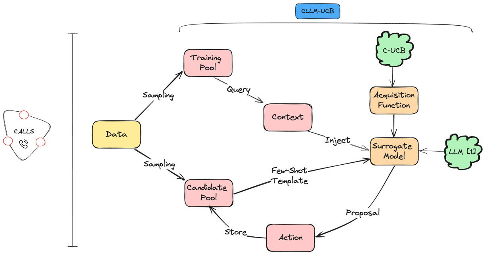
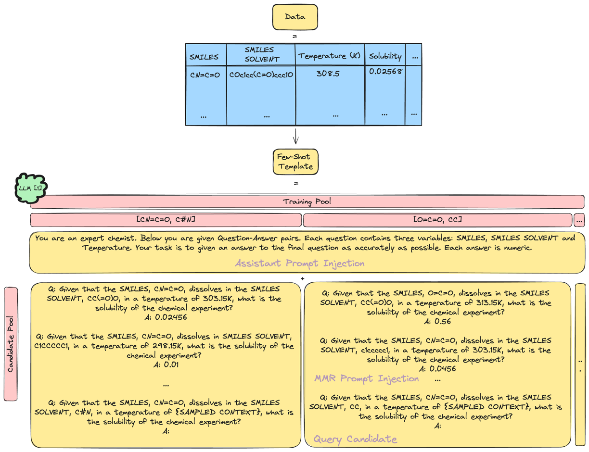
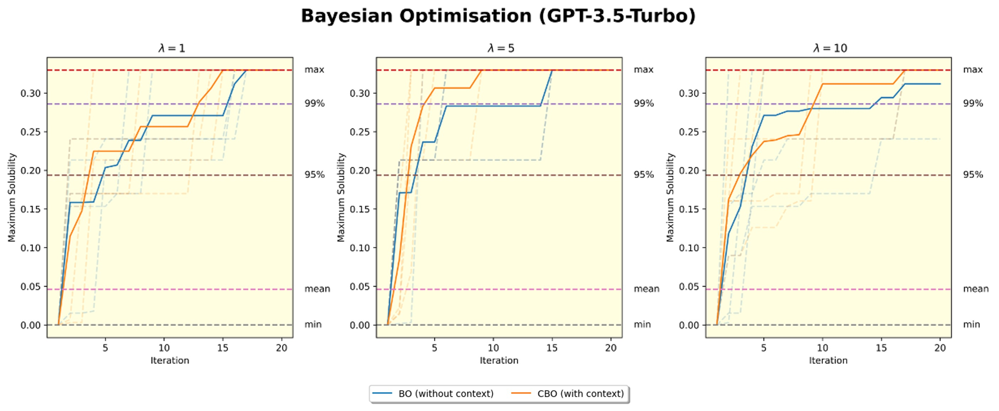
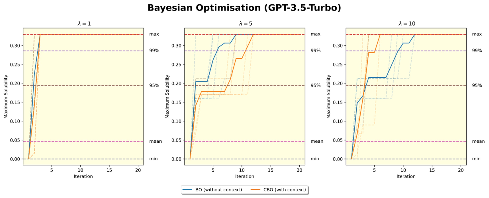
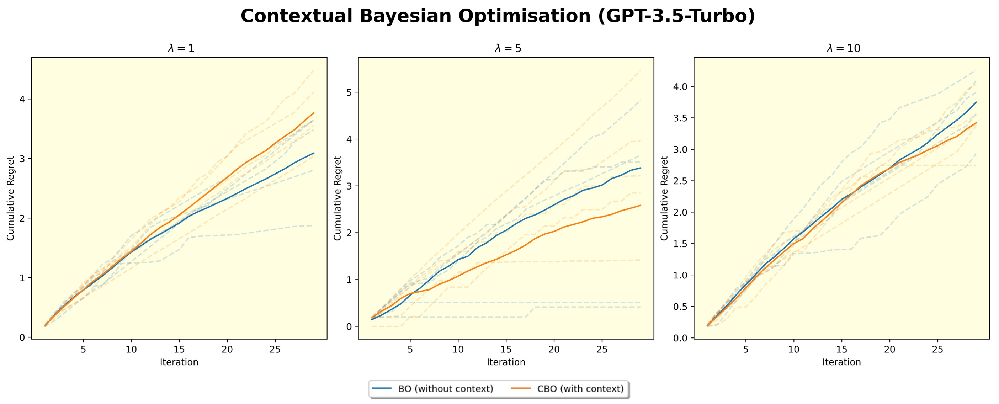
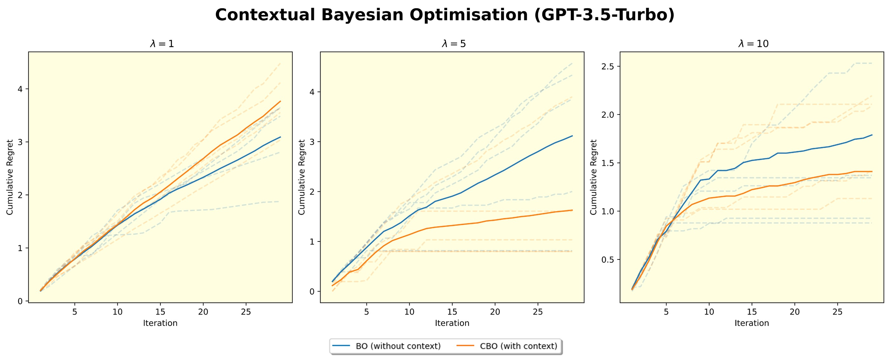
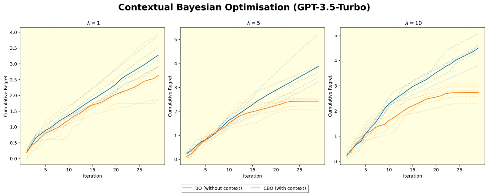
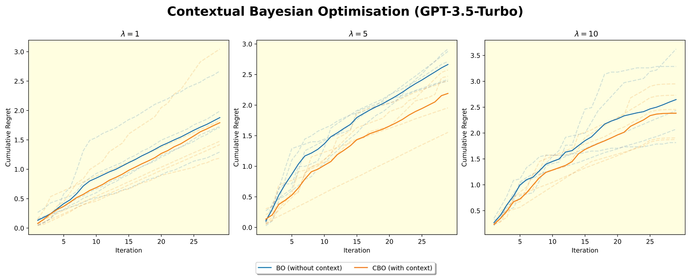
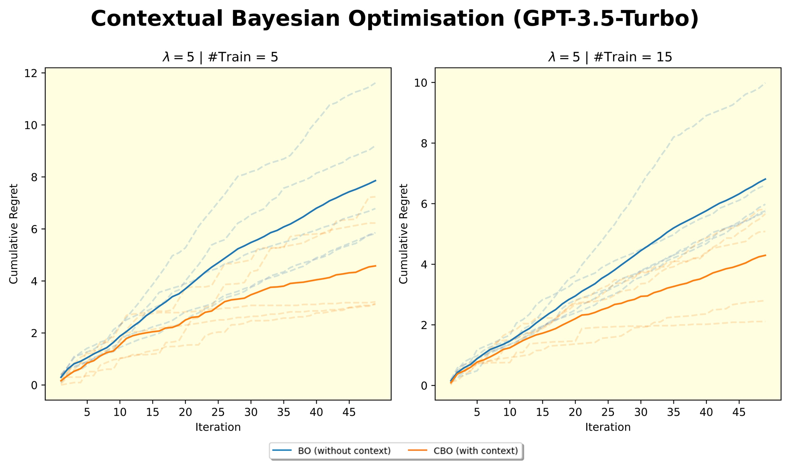

  

<h1 align="center">🧠 CALLS - Context Aware Large Language System 🧠</h1>

# IMPORTANT❗
> This project is under maintenance and as such, some files may not run. This will be fixed in due course.

# Table of Contents

- [Abstract](#abstract)
- [Novel Features](#novel-features)
- [Results](#results)

# Abstract 🌐
Contextual Bayesian Optimization (CBO) is a powerful framework for sequential decision-making w.r.t. an unknown function. Similar to Bayesian Optimization (BO), it utilizes surrogate models to approximate the unknown function, but with access to additional contextual information. An emerging concern is that current surrogate models are not well-equipped with CBO due to their failure to capture all system nuances and inefficient data sampling. To address this, we introduce $\textbf{C}$ontext $\textbf{A}$ware $\textbf{L}$arge $\textbf{L}$anguage $\textbf{S}$ystem ($\texttt{CALLS}$), which translates the optimisation protocol into a natural language interface and utilises the novel $\texttt{CLLM-UCB}$ algorithm. The algorithm combines a Large Language Model (LLM), as an alternative choice for the surrogate model via in-context learning (ICL) and, a Contextual Upper Confidence Bound (C-UCB) as the acquisition function. Our algorithm demonstrates that an LLM in a CBO framework, outperforms their counterpart in context-absent BO setup, by achieving sublinear contextual regret.

# Novel Features 💡
The main related works have focussed on:
1. Gausian Process (GP) as surrogate models, alongside Contextual Upper Confidence Bound (C-UCB), for Contextual Bayesian Optimisation (CBO) - [Andreas Krause and Cheng Soon Ong](https://proceedings.neurips.cc/paper_files/paper/2011/file/f3f1b7fc5a8779a9e618e1f23a7b7860-Paper.pdf).
2. Large Language Models (LLMs) as surrogate models, alongside Upper Confidence Bound, for Bayesian Optimisation (BO) - [Mayk Caldas Ramos, Shane S. Michtavy, Marc D. Porosoff and Andrew D. White](https://arxiv.org/pdf/2304.05341).

Given the rise of Generative AI, specifically LLMs, and their highlighted strengths as zero-shot and in-context learners, it seemed only fit to demonstrate a use case for these architectures within optimisation frameworks that require processing of contextual information. 
 
Therefore, our paper extends the current research by creating a novel system that processes contextual information through a Bayesian Optimisation (BO) framework i.e., Contextual Bayesian Optimisation (CBO), via a LLM, in an automated, dynamic and scalable way. This connection has not been investigated before, hence the novelty in our paper. 
 
We hypothesise that 1) a LLM possesses contextual understanding and thus, 2) can reliably provide uncertainty quantification and decision adjustments, given the presence of contextual information. 

# Data 📊
The dataset comes from BigSolDB, which is an expansive and diverse solubility dataset encompassing a wide range of organic compounds. Thorough preprocessing is applied to create a curated dataset, for which CBO can be performed on.

  

# Results 📈
Our experiments, across a broad combinatorial feature space with restricted data access, supports our hypotheses.

## Bayesian Optimisation 

- BO maximum solubility function across varying $\lambda$ values. Initial training size is 5 and 15 respectively, MMR selection size is min (initial train, 10), and iteration size is 20. 1 temperature with 1 unique action maximizer.

  

  

## Contextual Bayesian Optimisation

- Cumulative regret across varying $\lambda$ values. Initial training size is 5 and 15 respectively, MMR selection size is min(initial train, 10), and iteration size is 30. 2 temperatures with 1 unique action maximizer.

  

  

- Cumulative regret across varying $\lambda$ values. Initial training size is $5$ and $15$ respectively, MMR selection size is min(initial train, $10$), and iteration size is $30$. $2$ temperatures with $2$ unique action maximizers.

  

  

- Cumulative regret across varying $\lambda$ values. Initial training size is 15, MMR selection size is
min(initial train, 10), and iteration size is 50. 4 temperatures with 4 unique action maximizers.

  

